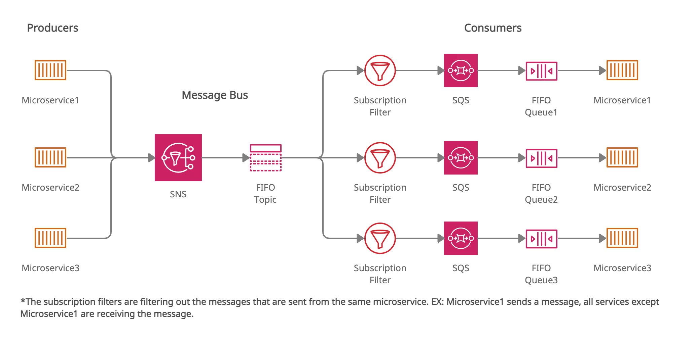

# SQS + SNS Microservice Communication Example

## Description

This project consists of three microservices. Each of them has the ability to send and consume messages. The messages are sent to an SNS FIFO Topic which sends the messages in the same order they were received and also can filter out duplicate messages. Behind every microservice we have a SQS FIFO Queue which is subscribed to the SNS Topic. Additionally each subscription has a filter which can filter out messages based on a message attribute.



### Additional Note

All of the microservices except for the 3rd one use `aws-sdk` to publish message to SNS and consume messages from SQS. The 3rd microservices uses a library called `sqs-consume` to consume the messages.

## Installation

Copy and fill out the config files with the appropriate parameters.

```bash
$ cp config-sample.json ./microservice1/config.json
$ cp config-sample.json ./microservice2/config.json
$ cp config-sample.json ./microservice3/config.json
```

## Running the app

```bash
docker-compose up
```
